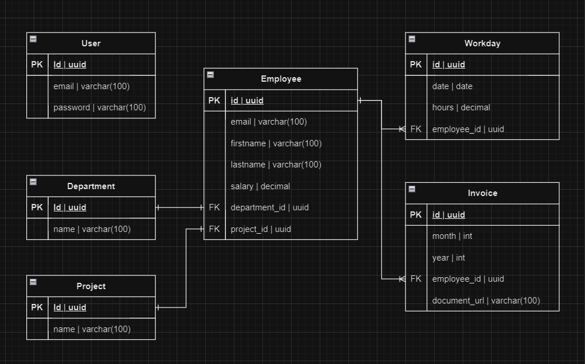
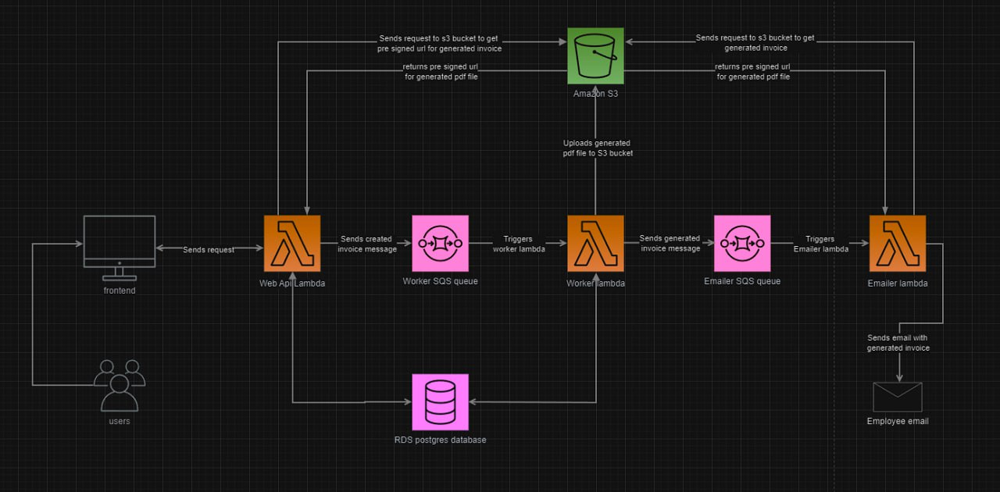

# Overview
This is an educational ASP.NET Core 8.0 REST API project built using FastEndpoints. It is designed to streamline the billing process for accounting purposes

# Technologies
- ASP.NET Core 8.0: The framework for building the web application.
- Entity Framework Core (PostgreSQL): The ORM for database interactions.
- xUnit: The testing framework.
- Docker: For containerization.
- Pub/Sub provider (AWS SQS): For message queuing.
- Fluent Validation: For validation.
- FastEndpoints: For creating endpoints quickly and efficiently.

# Database
The database is built using PostgreSQL and includes the following entities:

### Relationships Overview
- **User**: Independent entity with no direct relationships to other entities.
- **Employee**: Has many Workdays and Invoices; belongs to one Department and one Project.
- **Department**: Has many Employees.
- **Project**: Has many Employees.
- **Workday**: Belongs to one Employee.
- **Invoice**: Belongs to one Employee.

# Infrastructure
This study project explores AWS Cloud services, implementing a serverless architecture to understand its benefits and functionality. The system includes:

- Frontend: User interface that initiates requests to the backend.
- Web API Lambda: Handles incoming requests, demonstrating serverless API functionality.
- Amazon S3: Used for storing generated PDF files, showcasing cloud storage capabilities.
- Worker SQS Queue: Implements asynchronous task distribution, illustrating message queuing.
- Worker Lambda: Triggered by SQS messages, demonstrating background processing in serverless environments.
- RDS Postgres Database: Exemplifies relational database usage in cloud architectures.

### Data Flow

1. The frontend sends a request to the Web API Lambda.
2. Web API Lambda writes data to the RDS Postgres database.
3. Web API Lambda sends an invoice_id message to the Worker SQS Queue.
4. The Worker SQS Queue triggers the Worker Lambda.
5. Worker Lambda generates a PDF and uploads to S3. 
6. Worker Lambda updates the invoiceUrl field and saves changes to database.
7. Web API Lambda requests a pre-signed URL from S3 for the invoice to be generated.
8. S3 returns the pre-signed URL to the Web API Lambda.
